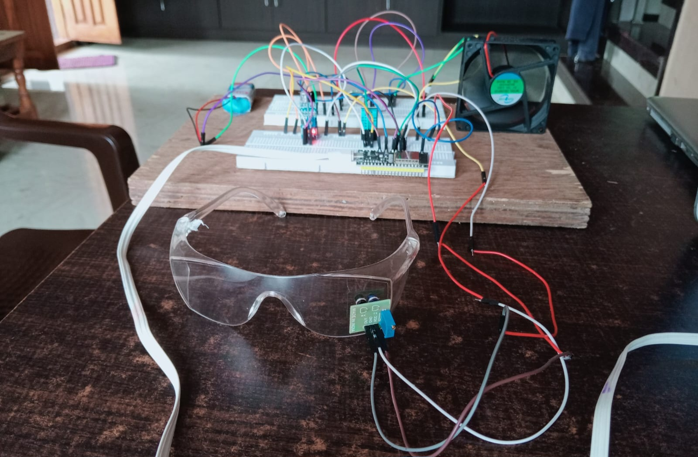
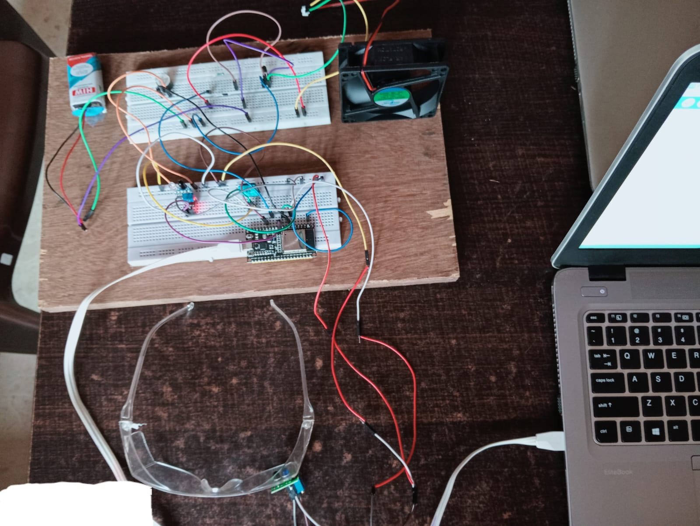
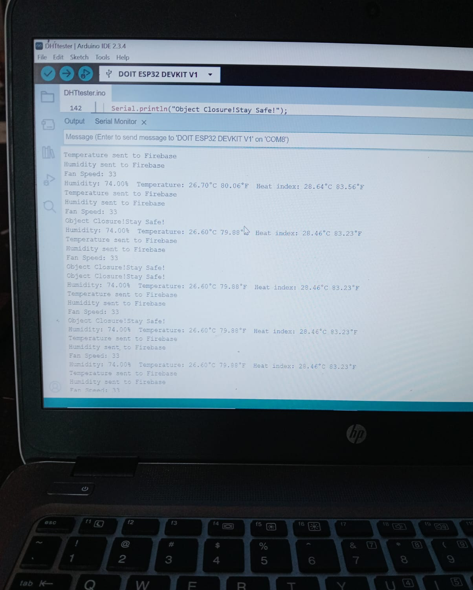
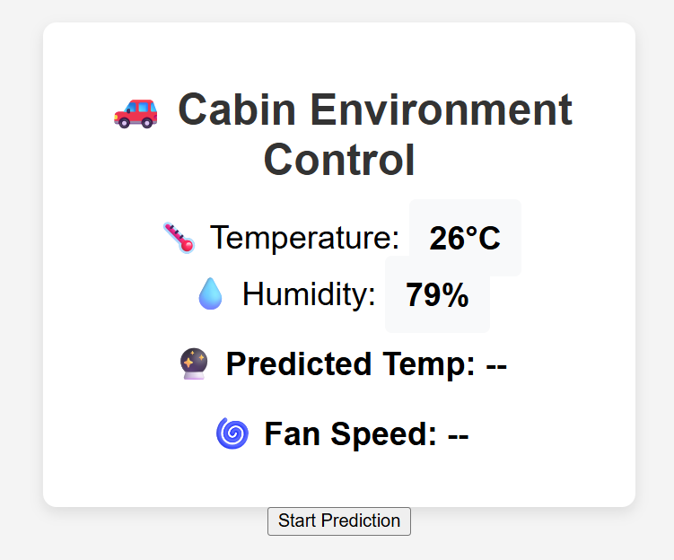
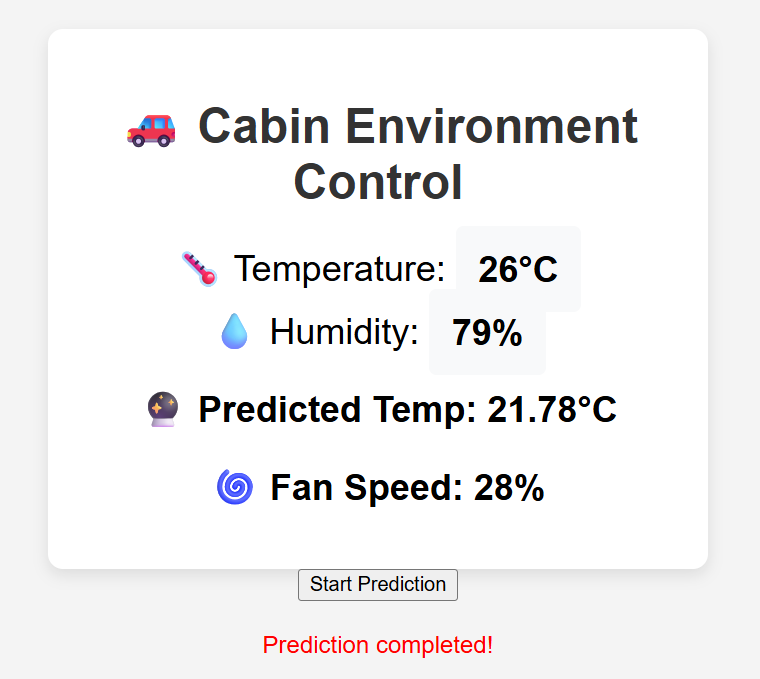

# Smart Cabin Environment and Safety monitoring system 🚗🌡️💨

This project aims to develop a comprehensive holistic cabin environment monitoring and control system.Its Basically designed to optimize the temperature,humidity levels within a vehicle's interior,understanding the fan speed as well as monitoring the fatigueness of the driver all with the help of firebase which is being used to analyze real time data. 

---
## ⚙️ Features

- 🔥 Temperature and Humidity Monitoring (DHT11)
- ❤️ Heart Rate and SpO2 Detection (MAX30100)
- 👁️ Eye Blink Detection (IR Sensor)
- 🚨 Fatigue Alert System with Buzzer
- 🌀 Automated Fan Control based on Predicted Temperature
- 🔄 Real-Time Firebase Integration
- 📊 Web Dashboard for Live Monitoring
- 🤖 Machine Learning Model for Temperature Prediction

---
## 🧱 Hardware Setup

  
  

## ✅ Final Working Output

  

## 🖥️ Web Dashboard

  
  

---
## 🧰 Tech Stack

**Hardware**: ESP32, DHT11, MAX30100, IR Sensor, Fan, Buzzer, Eye Blink Sensor 
**Languages**: Python, C++, HTML, CSS, JavaScript 
**Backend**: Flask 
**Database**: Firebase Realtime Database 
**ML Model**: Linear Regression (for temperature prediction) 
**Web Hosting**: Localhost

---
## 🚀 Setup Instructions

**1. Clone the Repository** 
git clone https://github.com/Desairo/SmartCabin.git 

**2. Hardware Setup** 
Connect DHT11 to ESP32 GPIOx 
MAX30100 for HR/SpO2 to I2C pins 
IR sensor to GPIOy 
Fan/Buzzer to digital outputs 

**3.Configure Firebase** 
Use your own firebase_config.json file 

**4.Install Flask and Requirements** 
pip install -r requirements.txt 
python app.py 

**5.Run on ESP32** 
Flash SmartCabin.ino using Arduino IDE with correct pins 

---
## 📂 Folder Structure
SmartCabin/ 
├── static/&nbsp;&nbsp;&nbsp;&nbsp;&nbsp;&nbsp;&nbsp;&nbsp;&nbsp;&nbsp;&nbsp;&nbsp;&nbsp;&nbsp;&nbsp;&nbsp;&nbsp;&nbsp;&nbsp;&nbsp;&nbsp;&nbsp;&nbsp;# CSS, JS files 
├── templates/&nbsp;&nbsp;&nbsp;&nbsp;&nbsp;&nbsp;&nbsp;&nbsp;&nbsp;&nbsp;&nbsp;&nbsp;&nbsp;&nbsp;&nbsp;# HTML files 
├── app.py&nbsp;&nbsp;&nbsp;&nbsp;&nbsp;&nbsp;&nbsp;&nbsp;&nbsp;&nbsp;&nbsp;&nbsp;&nbsp;&nbsp;&nbsp;&nbsp;&nbsp;&nbsp;&nbsp;&nbsp;&nbsp;&nbsp;# Flask server 
├── esp_code.ino&nbsp;&nbsp;&nbsp;&nbsp;&nbsp;&nbsp;&nbsp;&nbsp;&nbsp;&nbsp;&nbsp;&nbsp;# ESP32 embedded code 
├── firebase_config.json&nbsp;# Firebase credentials 
├── model.pkl&nbsp;&nbsp;&nbsp;&nbsp;&nbsp;&nbsp;&nbsp;&nbsp;&nbsp;&nbsp;&nbsp;&nbsp;&nbsp;&nbsp;&nbsp;&nbsp;&nbsp;# Trained ML model 
└── README.md 

---
## 🌐 Firebase Integration
All real-time sensor data is pushed to Firebase Realtime Database and fetched by the Flask server to display on the web dashboard and make predictions.

---
## 🔍 ML Prediction
**Model**: Linear Regression 
**Input** : Temp, Humidity, Previous Temp 
**Output**: Predicted Temp → used for Fan Speed Control 

---
⚠️ This repository previously contained Firebase API keys which have since been removed and revoked. Please use your own `firebase_credentials.json` file and do not commit secrets.
